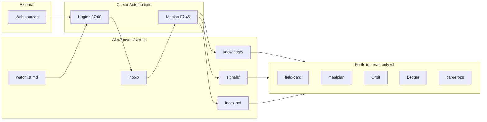
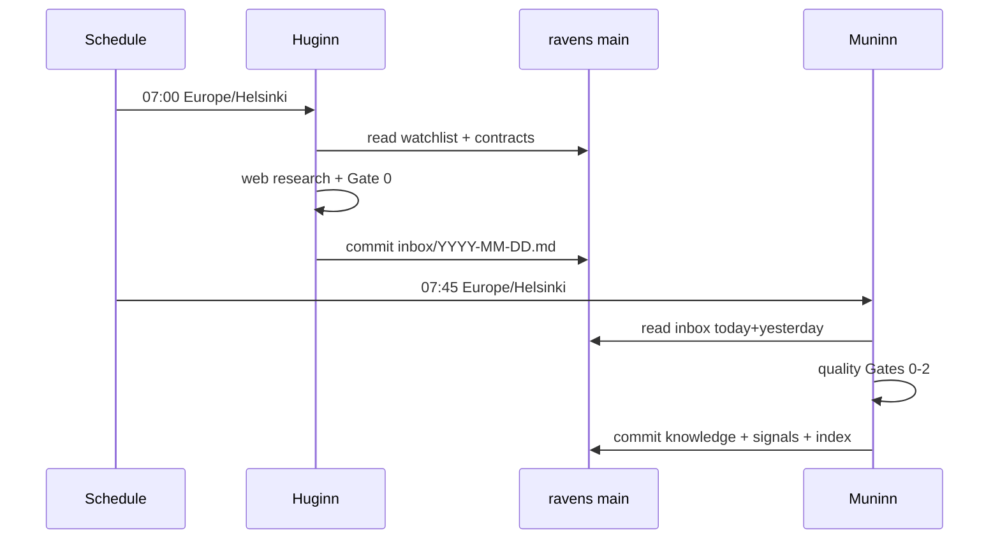
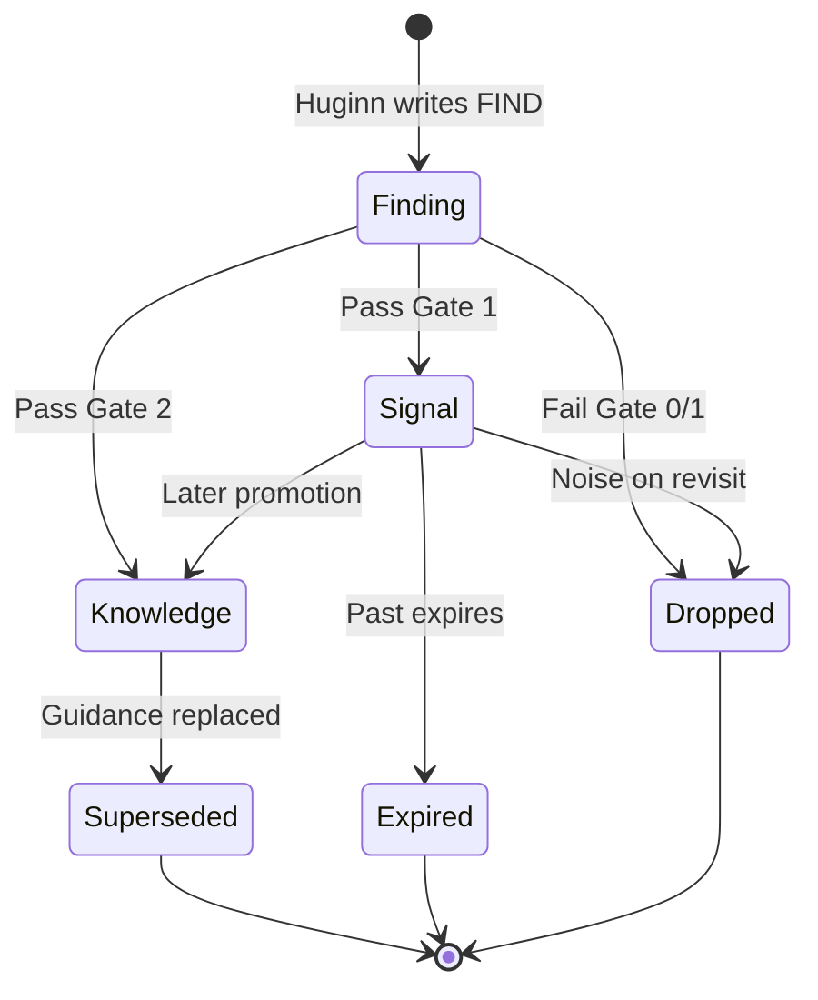
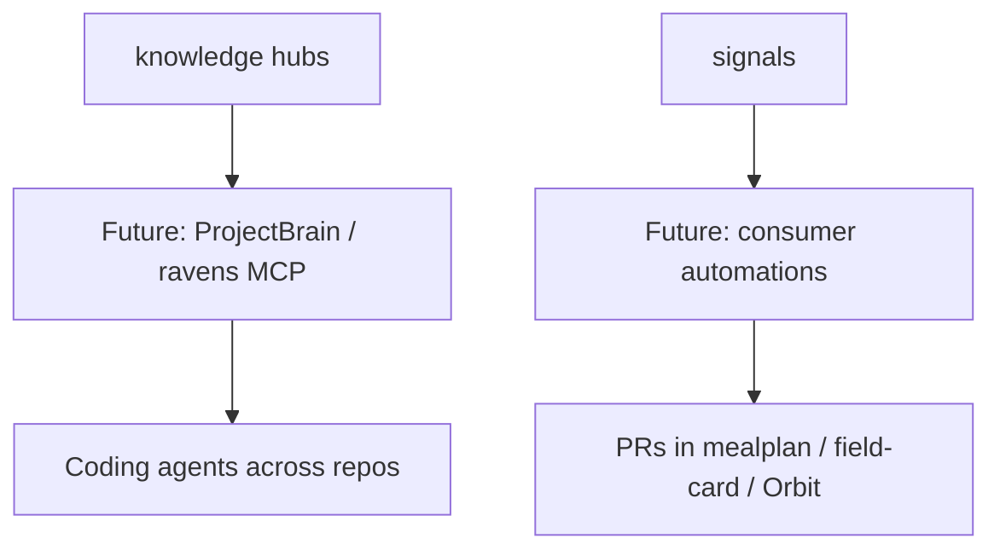

# Ravens system architecture

Canonical diagrams for the Huginn / Muninn knowledge vault. Orbit sync is optional later (`ravens-architecture`); source of truth is this folder.

## System context

## Daily data flow

## Artifact lifecycle

## Extension seams (not built yet)

